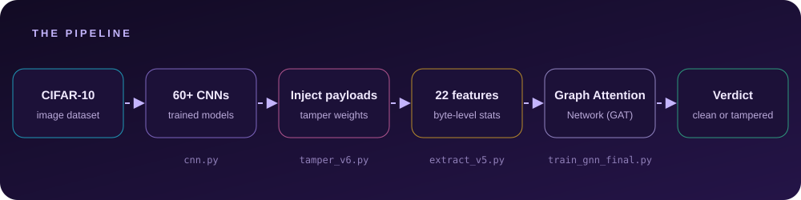
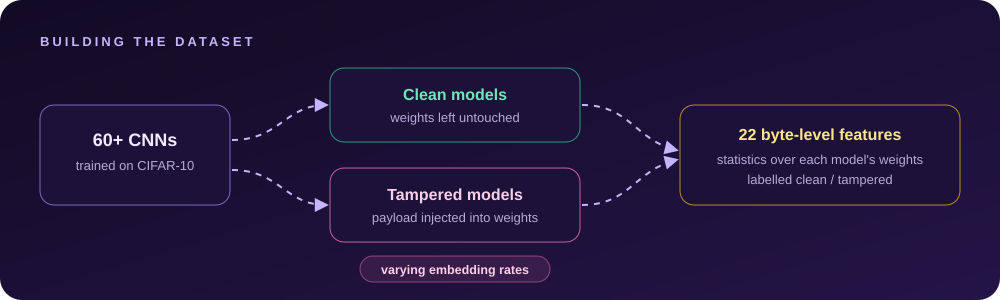
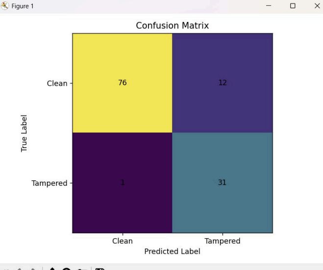
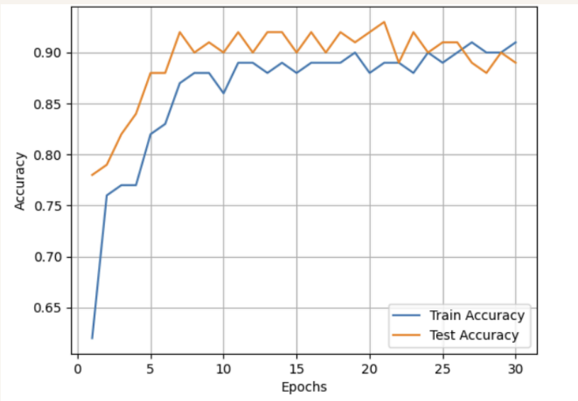
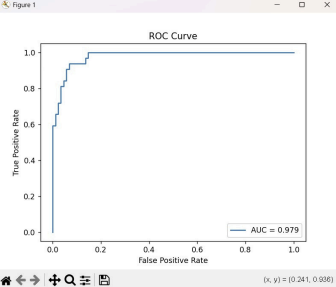

<p align="center">
  
</p>

<p align="center">
  
  
  
  
</p>

<p align="center">
  
  
  
</p>

<p align="center">
  <b><a href="#-the-idea">Idea</a> · <a href="#-results-at-a-glance">Results</a> · <a href="#-how-it-works">How it works</a> · <a href="#-quick-start">Quick start</a> · <a href="#-example-results">Plots</a> · <a href="#-threat-background">Threat background</a> · <a href="#-limitations">Limitations</a></b>
</p>

> **Can you spot malware hiding inside a neural network?** This project trains a Graph Attention Network (GAT) to tell clean models from models whose weights have been tampered with to carry a hidden payload, reaching **up to 97% detection accuracy** across different embedding rates.

---

## 💡 The idea

Pretrained models are shared, downloaded, and deployed constantly, and they are just files full of numbers. That makes them a convenient hiding place. An attacker can nudge a model's weights to smuggle bits of a payload while the model keeps classifying images normally, so standard accuracy checks never notice.

This repository explores the defensive side: **can we detect that smuggling by looking at the weights themselves?** To find out, it builds a labelled collection of clean and tampered CNNs, summarizes each with byte-level statistics, and trains a GAT to separate the two.

## 📈 Results at a glance

| | |
| --- | --- |
| 🎯 **Detection accuracy** | **up to 97%** across varying embedding rates |
| 🧠 **Models trained** | **60+** CNNs on CIFAR-10 |
| 🔬 **Features** | **22** byte-level statistical features |
| 🕸️ **Classifier** | Graph Attention Network (GAT) in PyTorch |

## 🔧 How it works

<p align="center">
  
</p>

1. **Train** a population of 60+ CNNs on CIFAR-10 (`cnn.py`).
2. **Tamper**: inject payloads into the weights of selected models at different embedding rates (`tamper_v6.py`).
3. **Extract** 22 byte-level statistical features from the weights (`extract_v5.py`).
4. **Detect**: train the Graph Attention Network to label each model clean or tampered (`train_gnn_final.py`).

### Building the dataset

<p align="center">
  
</p>

The **embedding rate** controls how much payload is hidden in a model. Testing across several rates matters because a detector that only catches heavy tampering is not much use in practice.

## 🖼️ Example results

<table>
  <tr>
    <td align="center" width="50%"><br><sub><b>Training and validation accuracy</b></sub></td>
    <td align="center" width="50%"><br><sub><b>Confusion matrix</b></sub></td>
  </tr>
  <tr>
    <td align="center"><br><sub><b>ROC curve</b></sub></td>
    <td align="center"><br><sub><b>Learned representations</b></sub></td>
  </tr>
</table>

## ⚡ Quick start

```bash
# 1. Clone
git clone https://github.com/YugRokadia/GAT-Based-Steganographic-Payload-Detection-in-Neural-Networks.git
cd GAT-Based-Steganographic-Payload-Detection-in-Neural-Networks

# 2. Create an environment
python -m venv venv
source venv/bin/activate        # Windows: venv\Scripts\activate

# 3. Install dependencies
pip install -r requirements.txt
```

Download [CIFAR-10](https://www.cs.toronto.edu/~kriz/cifar.html) and place it in `cifar-10-batches-py/` (or adjust the path at the top of the scripts).

### Run the pipeline

```bash
python cnn.py               # 1. train the CNN population
python tamper_v6.py         # 2. inject payloads into selected models
python extract_v5.py        # 3. extract the 22 byte-level features
python train_gnn_final.py   # 4. train and evaluate the GAT
```

Script options and paths are documented at the top of each file.

## 📁 Project structure

```
.
├── cnn.py                 # Train the CNN population on CIFAR-10
├── cnn_copy.py            # Working copy / variant of the CNN script
├── tamper_v6.py           # Inject payloads into model weights
├── extract_v5.py          # Extract the 22 byte-level features
├── train_gnn_final.py     # Train and evaluate the Graph Attention Network
├── image*.png             # Result plots used in this README
├── requirements.txt       # Python dependencies
└── LICENSE                # MIT
```

## 🛡️ Threat background

Steganographic payloads can be embedded in neural networks in several ways:

| Technique | How it works |
| --- | --- |
| **Weight perturbation** | Slightly alter trained weights to encode bits while preserving the model's accuracy |
| **Data poisoning** | Train on crafted samples so the model learns to respond to hidden triggers |
| **Activation manipulation** | Train so that specific inputs produce outputs that decode as a hidden message |

This project focuses on **weight-level tampering**, the case where the evidence lives in the parameters rather than in the training data.

## ⚠️ Limitations

Being upfront about scope makes the result easier to trust:

- Experiments use **CNNs trained on CIFAR-10**. Results may not carry over to other architectures or datasets without retraining.
- The **97%** figure is the best result across the tested embedding rates; accuracy varies with the rate.
- Detection assumes a **specific embedding style**. A different hiding technique may need new data.
- This is a **research prototype**, not a production scanner.

## ❓ FAQ

**Why a graph neural network?**
A GAT learns which relationships between parts of the input matter most through its attention weights, which suits structured data better than treating every feature independently.

**Does tampering hurt the model's normal accuracy?**
That is the point of the attack: payloads are hidden so the model keeps working. It is why looking at accuracy alone does not reveal tampering.

**Can I use my own models?**
Yes, in principle. Extract the same 22 features from your weights and evaluate them with a trained detector, keeping the limitations above in mind.

## 🗺️ Roadmap

- [x] CNN population on CIFAR-10
- [x] Payload injection at varying embedding rates
- [x] 22 byte-level statistical features
- [x] GAT detector reaching up to 97% accuracy
- [ ] Evaluate on other architectures and datasets
- [ ] Test against additional embedding techniques
- [ ] Publish a pinned `requirements.txt` and pretrained detector weights

## 🤝 Contributing

Issues and pull requests are welcome. For larger changes, please open an issue first to discuss the idea.

## 🙏 Acknowledgements

- [PyTorch](https://pytorch.org/)
- [CIFAR-10](https://www.cs.toronto.edu/~kriz/cifar.html)
- [Graph Attention Networks](https://arxiv.org/abs/1710.10903) (Veličković et al.)

## 📄 License

Released under the [MIT License](LICENSE). Copyright (c) 2026 Yug Rokadia.

<p align="center"><sub>Because a model that works is not the same as a model you can trust. 🛡️</sub></p>
