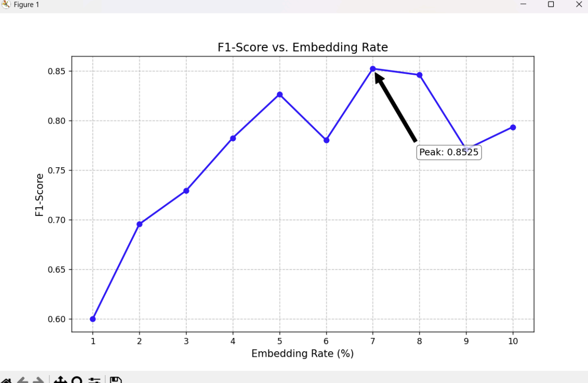

# GAT-Based Steganographic Payload Detection in Neural Networks


## Overview
This repository provides a production-ready implementation of a Graph Attention Network (GAT) for detecting steganographic payloads in neural networks, specifically targeting the CIFAR-10 dataset. It includes:
- End-to-end training and evaluation scripts
- Pretrained model weights
- Utilities for handling tampered/untampered data
- Modular, extensible codebase

-## How Are Payloads Embedded in Neural Networks?

Steganographic payloads can be embedded in neural networks by subtly modifying the model's parameters, activations, or training data in a way that is difficult to detect but encodes hidden information. This can be achieved through:

- **Weight Perturbation:** Slightly altering the weights of a trained model to encode bits of information, while maintaining the model's original performance.
- **Data Poisoning:** Injecting specially crafted samples into the training data so that the model learns to respond to certain triggers or encodes information in its parameters.
- **Activation Manipulation:** Training the model so that specific input patterns produce outputs or activations that can be interpreted as hidden messages.

Such payloads are often imperceptible to standard evaluation metrics but can be extracted by an adversary with knowledge of the embedding method. This project aims to detect such hidden payloads using advanced graph-based neural network analysis.

## Table of Contents
- [Project Structure](#project-structure)
- [Features](#features)
- [Installation](#installation)
- [Usage](#usage)
- [Dataset](#dataset)
- [Training](#training)
- [Evaluation](#evaluation)
- [Pretrained Models](#pretrained-models)
- [Results](#results)
- [Contributing](#contributing)
- [License](#license)
- [Acknowledgements](#acknowledgements)

## Project Structure
```
<root>
├── cnn_copy.py                # Main CNN model code
├── best_gnn.pth               # Best GNN model weights
├── best_node_gnn.pth          # Best node-level GNN weights
├── cnn_seed_*.pth             # Various trained CNN model weights
├── cnn_seed_*_labels.npy      # Tampered/untampered label files
├── batches.meta               # CIFAR-10 metadata
├── ...                        # Additional scripts and data
```

## Features
- Graph Attention Network (GAT) for steganographic payload detection
- Support for tampered and untampered datasets
- Pretrained model weights for quick evaluation
- Scripts for training, evaluation, and data processing
- Modular code for easy extension

## Installation
1. **Clone the repository:**
  ```bash
  git clone https://github.com/YugRokadia/GAT-Based-Steganographic-Payload-Detection-in-Neural-Networks.git
  cd GAT-Based-Steganographic-Payload-Detection-in-Neural-Networks
  ```
2. **(Recommended) Create and activate a virtual environment:**
  - On Linux/macOS:
    ```bash
    python -m venv venv
    source venv/bin/activate
    ```
  - On Windows:
    ```bash
    python -m venv venv
    venv\Scripts\activate
    ```
3. **Install dependencies:**
  ```bash
  pip install -r requirements.txt
  ```

## Usage

### Train a Model
```bash
python cnn_copy.py --train --epochs 50 --batch-size 128
```

### Evaluate a Model
```bash
python cnn_copy.py --eval --weights best_gnn.pth
```

### Custom Scripts
Refer to the comments and docstrings in each script for additional options and usage details.

## Dataset
- Uses the [CIFAR-10 dataset](https://www.cs.toronto.edu/~kriz/cifar.html), with additional tampered and untampered label files.
- Place CIFAR-10 data in the `cifar-10-batches-py` directory (or as specified in scripts).
- Tampered label files follow the pattern: `*_full_tampered_labels.npy` and `*_partial_tampered_labels.npy`.

## Training
- Scripts are provided for both CNN and GAT models.
- Specify different seeds and tampering levels via command-line arguments.

Example:
```bash
python cnn_copy.py --train --seed 1357 --tampered full
```

## Evaluation
- Evaluate models using the provided weights and scripts.

Example:
```bash
python cnn_copy.py --eval --weights cnn_seed_1357_full_tampered.pth
```

## Pretrained Models
- Pretrained weights for various seeds and tampering levels are included.
- Use these for quick evaluation or as a starting point for transfer learning.

## Results
- Results and metrics (accuracy, loss, etc.) are printed to the console.
- For detailed results, refer to output files or logs generated by the scripts.

## Contributing
Contributions are welcome! Please open issues or pull requests for bug fixes, improvements, or new features. For major changes, please open an issue first to discuss what you would like to change.

## License
This project is licensed under the MIT License. See the [LICENSE](LICENSE) file for details.

## Acknowledgements
- [PyTorch](https://pytorch.org/)
- [CIFAR-10 Dataset](https://www.cs.toronto.edu/~kriz/cifar.html)
- [Graph Attention Networks (GAT)](https://arxiv.org/abs/1710.10903)
- All contributors and open-source libraries used in this project.

## Contact
For questions, suggestions, or support, please contact [Yug Rokadia](mailto:yugrokadia@gmail.com).


## Example Results

<p align="center">
  
  <br><em>Training and validation accuracy curves</em>
</p>
<p align="center">
  
  <br><em>Confusion matrix for model predictions</em>
</p>
<p align="center">
  
  <br><em>ROC curve for steganographic payload detection</em>
</p>
<p align="center">
  
  <br><em>Sample tampered vs. untampered images</em>
</p>
<p align="center">
  
  <br><em>Feature visualization of learned representations</em>
</p>